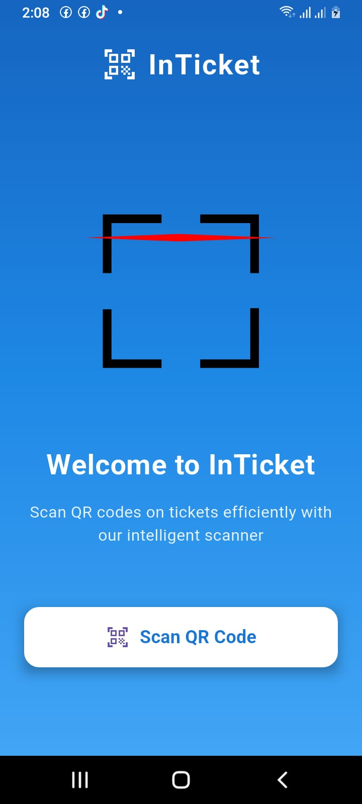
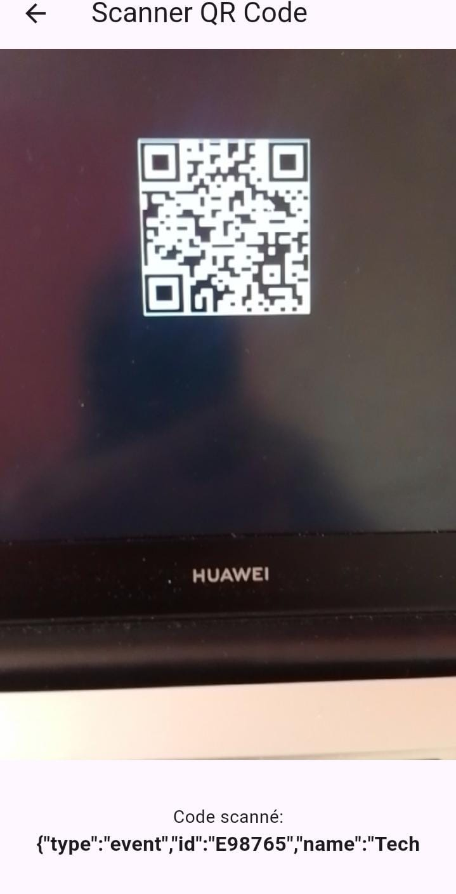

# InTicket QR Code Scanner App

## Overview
The **InTicket** app is a Flutter-based mobile application that allows users to scan QR codes on tickets efficiently. The app features an intuitive and smooth interface with animations to make the scanning experience interactive. The app leverages the **mobile_scanner** package to scan QR codes and provides a simple and effective way for users to verify and manage ticket information.

## Features
- **QR Code Scanning**: Users can scan QR codes on tickets using the app's built-in scanner.
- **User-Friendly Interface**: The app features a visually appealing design with a gradient background and custom animations.
- **Lottie Animations**: The app uses **Lottie** for animated visuals to enhance the user experience.
- **Dynamic UI**: Elements such as the app bar, logo, and buttons animate smoothly as the user interacts with the app.

## Key Screens
1. **Accueil Page (Home Page)**:
   - Displays the app logo and a welcoming message.
   - Provides a "Scan QR Code" button that leads to the QR scanner screen.
   - The UI includes smooth animations for the logo and welcome text.



2. **QR Scanner Page**:
   - This page allows users to scan a QR code using the phone's camera.
   - After scanning, the app can display the ticket information or perform any further action depending on the use case.
 


## Technologies
- **Flutter**: The app is built using Flutter to ensure cross-platform compatibility (iOS and Android).
- **mobile_scanner**: This package is used for QR code scanning functionality.
- **Lottie**: Lottie animations are used for creating interactive visual effects in the app.
- **permission_handler**: Used to handle permissions for accessing the device camera.

## Setup Instructions
To run the app locally, follow these steps:

1. **Clone the Repository**:
   ```bash
   git clone <repository-url>
## Install Dependencies

To install the dependencies for the project, follow these steps:

 1. **Navigate to the project directory**:
   First, open your terminal and change the current working directory to the root of your Flutter project. You can do this with the `cd` (change directory) command:
   
   ```bash
   cd path/to/your/project  
  


